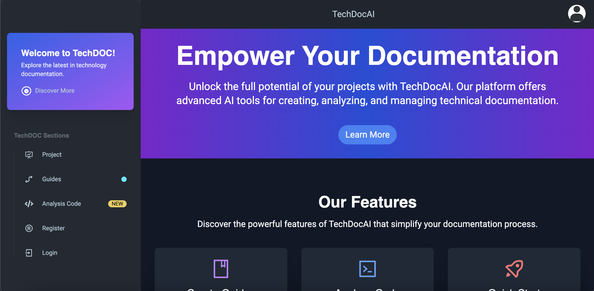
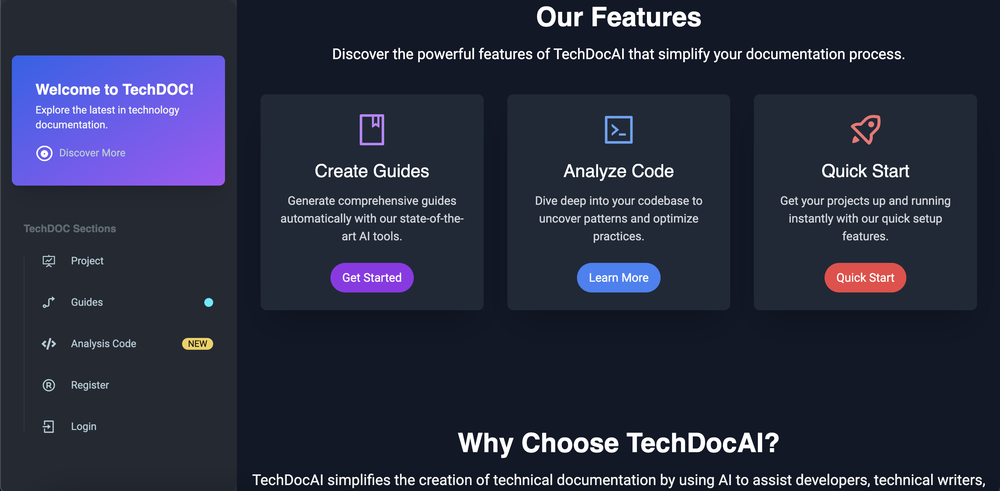
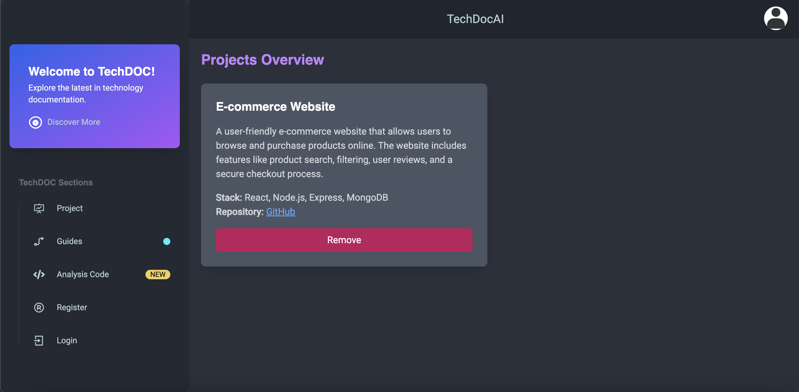
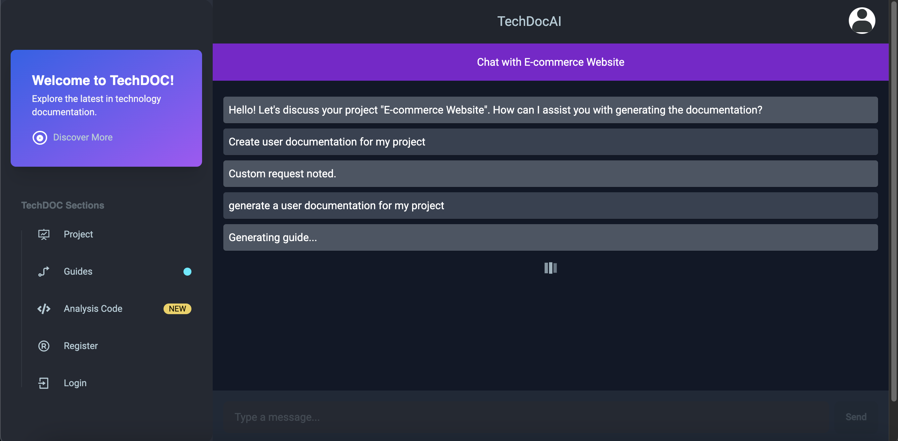
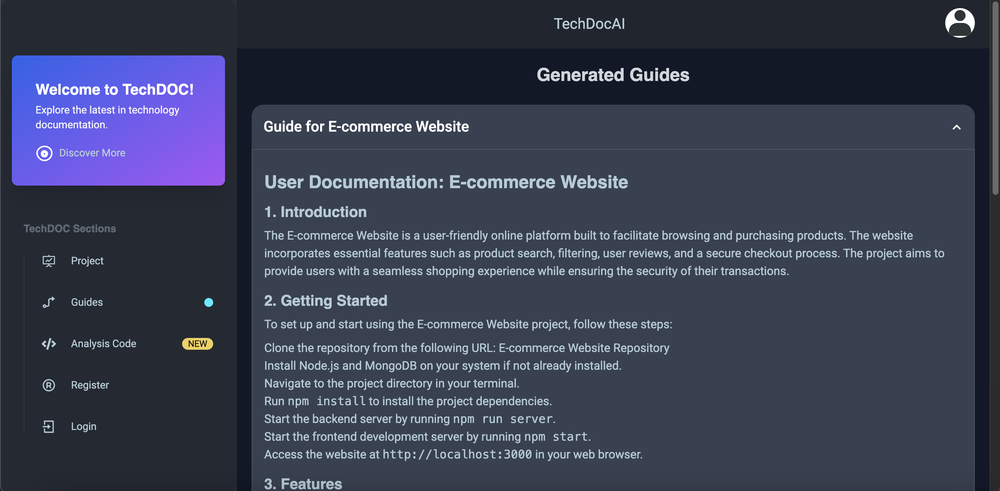
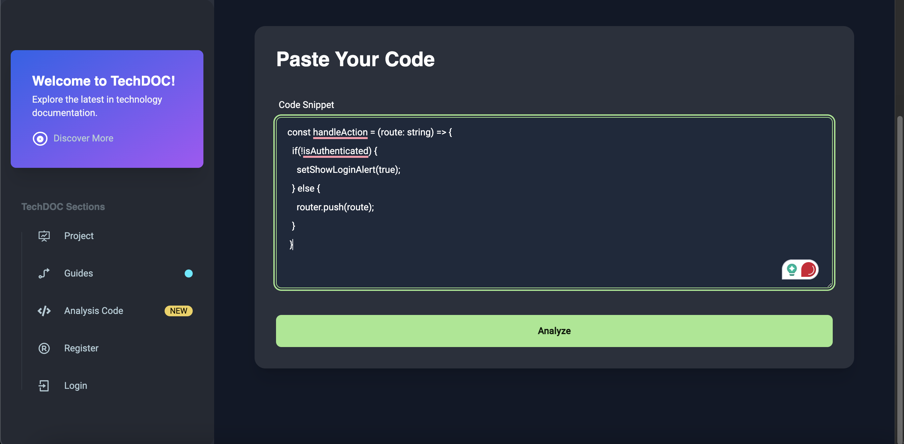
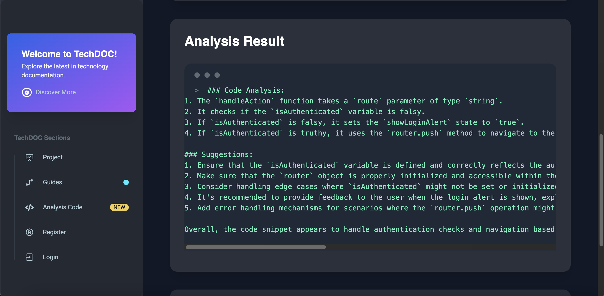

# Techdoc Application

Welcome to the **Techdoc-Application** documentation application repository. This application is designed for generating technical documentation based on a particular project, utilizing a modern tech stack comprising Next.js with TypeScript for the frontend, Typescript for the backend with Chatgpt-4 intergated for the generation of documentation. We leverage MongoDB for data persistence, ensuring a robust and scalable solution.

## Features

- **User Registration and Profile Management**: Users can register and maintain their profiles.
- **Project Management**: Users can add projects, view projects and delete projects.
- **Guide Creation**: Once Project is Added, Users can generate a documnetation guide for their projects
- **Code Analysis**: Users can use our advance AI to analysis their code based and know where their making mistake

## Technology Stack

- **Frontend**: Next.js, TypeScript
- **Backend**: Typescript, Prsima, Chat-gpt4
- **Database**: MongoDB

## Getting Started

### Installation

1. Clone the repository:
   ``git clone https://github.com/lokytech5/techdoc.git``

2. Navigate to the project directory:
   ``cd techdoc``

3. Install the dependencies:
   ``npm install``

## Configuration

Create a .env file in the root directory and add the following configurations:
``NEXT_PUBLIC_BASE_UR=<url to backend>``

## Running The Application

- **Run the application in development model**:
  ``npm run dev``

## Build the application for production:

``npm run build ``
``npm start``

## Contributing

Contributions to the Techdoc project are welcome. Please refer to the CONTRIBUTING.md file for guidelines.

## License

This project is licensed under the MIT License - see the LICENSE file for details.
